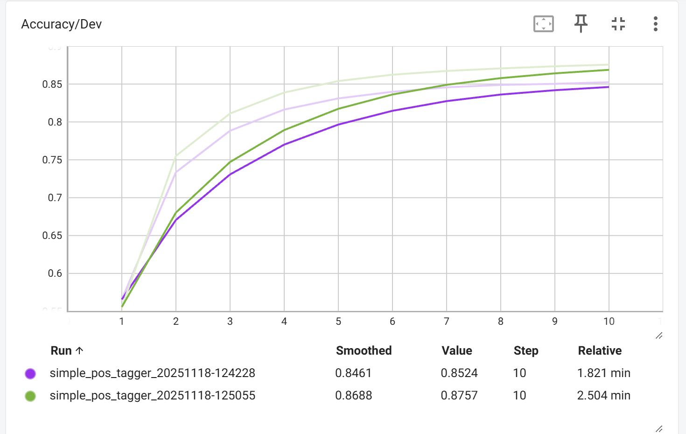
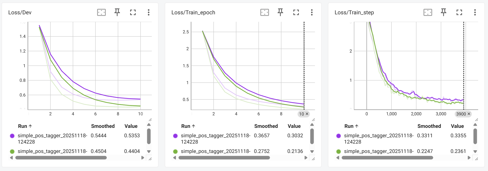
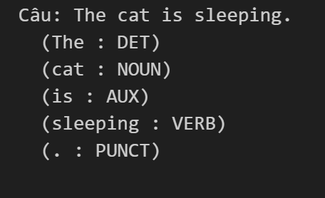

# Lab 6 - Part 3: POS Tagging với SimpleRNN

## Source code
- **File thực thi**: `src\lab6\lab6_part3.ipynb`  
- **logs**: `src\lab6\runs\`
- **model**: `src\lab6\pos_tagger_model.pth`
- **Cấu trúc notebook**:
    + **Task 1**: Tiền xử lý dữ liệu Universal Dependencies English-EWT và xây dựng từ điển
    + **Task 2**: Tạo PyTorch Dataset và DataLoader
    + **Task 3**: Xây dựng mô hình SimpleRNN
    + **Task 4**: Huấn luyện mô hình
    + **Task 5**: Đánh giá mô hình
Mỗi task được thực hiện tuần tự và kết quả được hiển thị ngay dưới từng cell code.

## KIẾN TRÚC MÔ HÌNH
- **Hash-based vocabulary**: 16,384 buckets
- Sử dụng SimpleRNN -> mở rộng Bidirectional RNN 
- **Parameters**: ~ 1.7M parameters
- **Input/Output**: Variable length sequences với padding

## KẾT QUẢ THỰC HIỆN

- Mô hình Bi-RNN (đường xanh lá) cho thấy hiệu suất, tốc độ hội tụ nhanh và tốt hơn so với Simple RNN (đường màu tím).

=> Kiến trúc hai chiều (Bidirectional) giúp mô hình có khả năng nắm bắt ngữ cảnh toàn diện tốt hơn trong bài toán này.
### SimpleRNN (Unidirectional)
- Cấu hình: RNN đơn hướng với hidden_dim=64
- Độ chính xác trên tập dev: **85.24%**
- Nhận xét: RNN đơn hướng chỉ sử dụng context từ trước đó

### Bidirectional RNN 
- Cấu hình: RNN hai hướng với hidden_dim=64 -> output_dim=128
- Độ chính xác trên tập dev: **87.57%**
- Cải thiện: **+2.6%** so với RNN

### Ví dụ dự đoán câu mới:
- Câu: "The cat is sleeping."
- Dự đoán: DET - NOUN - AUX - VERB - PUNCT --> TRUE

## Nhận xét: 
### So sánh hiệu suất:
- **SimpleRNN**: 85.0% - RNN đơn hướng xử lý sequence từ trái qua phải
- **Bidirectional RNN**: 87.6% - Sử dụng context từ cả hai hướng, hiệu quả hơn

### Ưu điểm của Bidirectional:
- Capture được thông tin từ cả past và future context
- Cải thiện đáng kể (+2.6%) cho bài toán sequence labeling
- Phù hợp với POS tagging vì từ loại phụ thuộc vào context xung quanh

## Cite References
- Data: Universal Dependencies English-EWT
- Tools: PyTorch, TensorBoard